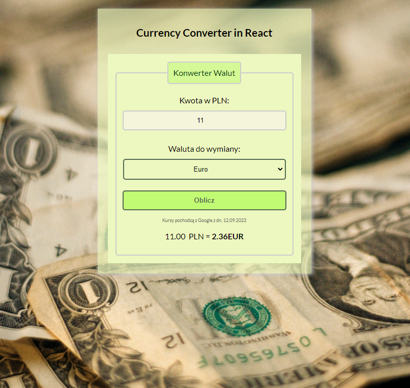

# Currency Converter React

App to convert chosen currency to PLN. App for studies

## Demo

https://mr-susel.github.io/currency-converter-react/

## Repo

https://github.com/Mr-SuSeL/currency-converter-react

## App Screenshot

## Describe

In this version, the currency exchange rates are hardcoded. But of course You have a little table help with fresh currency rates. It will change in future version which will be based on React library.

### Page features

- ECMAScript +06 features
- React 18 library
- Source code based on function structure

## Getting Started with Create React App

This project was bootstrapped with [Create React App](https://github.com/facebook/create-react-app).

## Available Scripts

In the project directory, you can run:

### `npm start`

Runs the app in the development mode.\
Open [http://localhost:3000](http://localhost:3000) to view it in your browser.

The page will reload when you make changes.\
You may also see any lint errors in the console.

### `npm run build`

Builds the app for production to the `build` folder.\
It correctly bundles React in production mode and optimizes the build for the best performance.

The build is minified and the filenames include the hashes.\
Your app is ready to be deployed!

See the section about [deployment](https://facebook.github.io/create-react-app/docs/deployment) for more information.

### `npm run deploy`

Deployment by gh-pages package
